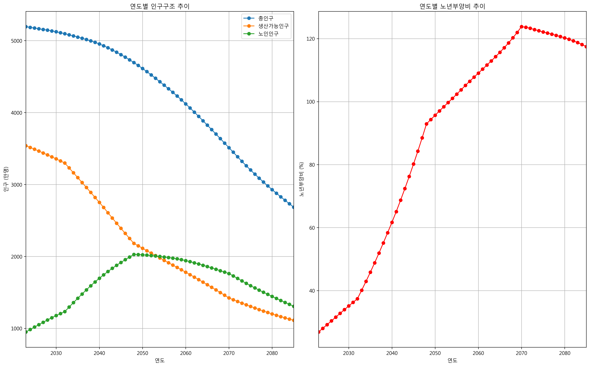
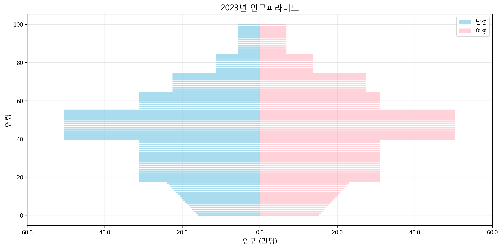

# 국민연금 ALM 간소화 모델 

박정현 
jh70035@gmail.com 

## 프로젝트 소개 

### 기반 자료
- [연차보고서 2023-02 - 2024년 국민연금기금의 자산배분 -ALM분석을 중심으로]
- [국민연금 제5차 재정계산 결과 (2023)](https://nsp.nanet.go.kr/plan/subject/detail.do?nationalPlanControlNo=PLAN0000037347)

## 주요 기능
- 인구모듈(DemographicModule)
- 거시경제변수 모듈 (EconomicModule)
- 가입자 모듈 (SubscriberModule)
- 급여지출 모듈 (BenefitModule)
- 재정수지 모듈 (FinanceModule)

### 주요 결과
- 제5차 재정추계 보고서와 같은 결과를 재현하였습니다.
- 국민연금 적립금은 2038년 1,796조원으로 최고치에 도달한 후 지속적으로 감소하고 2055년 소진됩니다.
- 수입보다 지출이 더 커지는 수지적자는 2039년부터 발생할 것으로 예측되었습니다. 
- 노인부양비는 지속적으로 증가하여 2070년 124%에 이릅니다. 

### 주요 결과 그래프

#### 1. 연도별 적립금 추이

- 기금은 2038년에 최대 적립금 도달후 지속 감소 추세
- 2039년 최초로 기금 적자 전환
- 2055년 기금 소진

#### 2. GDP대비 급여지출

#### 3. 인구구조 변화

- 총인구 및 생산가능인구 감소 추세
- 노년부양비는 지속적으로 증가하여 2070년 124%에 이릅니다.

#### 3.1 인구 피라미드

- 2023년 기준 인구구조를 보여주는 인구 피라미드
- 40-50대가 가장 많은 인구 구조
- 저출산으로 인한 0-17세 인구의 급격한 감소
- 65세 이상 고령인구의 증가 추세

#### 4. 민감도 분석
기본가정(소득대체율 40%, 보험료율 9%)에서 주요 변수들의 민감도는 다음과 같습니다:

- 보험료율 1% 증가시 최대적립금 258.5조원 증가
- 보험료율 1% 증가시 기금소진연도 2.5년 연장
- 소득대체율 1% 증가시 기금소진연도 0.5년 단축

##### 4.1 보험료율에 따른 적자 전환 및 기금 소진 연도

- 보험료율이 증가함에 따라 적자 전환 연도와 기금 소진 연도가 늦춰지는 경향을 보임
- 보험료율이 높을수록 기금 소진이 지연됨

##### 4.2 소득대체율에 따른 적자 전환 및 기금 소진 연도  

- 소득대체율이 증가할수록 적자 전환 연도와 기금 소진 연도가 앞당겨지는 경향을 보임
- 소득대체율이 높을수록 급여지출이 증가하여 기금 소진이 가속화됨

## 주요 매개변수(기본가정)
### 인구 변수
- 합계출산율: 2023년 0.73명 → 2050년 1.21명
- 기대수명: 2023년 84.3세 → 2070년 91.2세
- 국제순이동: 연간 4-5만명 수준

### 경제 변수
- GDP 성장률: 2023년 2.2% → 2060년 0.7%
- 임금상승률: 2023년 2.3% → 2060년 1.5%
- 물가상승률: 2023년 3.3% → 2027년 이후 2.0%

### 연금 변수
- 보험료율: 9%
- 소득대체율: 40%
- 수급개시연령: 65세

## 참고문헌
- 국민연금 제5차 재정계산 결과 (2023)
https://nsp.nanet.go.kr/plan/subject/detail.do?nationalPlanControlNo=PLAN0000037347
- 통계청 2023년 사망원인통계 (2023)
- 고용노동부 근로자의 평균임금(성/사업체규모/연령별) 통계 (2024)
- 통계청 총조사인구 성/연령별 통계 (2024)

## 향후 개선 계획 

### 개선사항
- 최근 금리 상승을 반영한 재정추계 재계산
  - 국제 경제상황 변동 반영
  - 금리 민감도 분석

### 중장기 개선사항
- 확률론적 시뮬레이션 (Monte Carlo Simulation)
  - 기금정책이 외부 충격변수에 대해서 기금 안정성을 담보할 수 있는지 여부
- 상관관계 모델링을 통한 동적 최적화 (최적 보험률과 소득대체율 탐색)

## 실행 방법
### 1. 단일 모델 실행(기본가정)
- 기본가정 모델: `python NPS_model.py`
### 2. 시나리오 분석과 시각화
- 시나리오 분석석 : `python simulation.py`

## 출력 결과
모델은 다음 CSV 파일과 이미지 파일을 생성합니다:
- `csv/financial_results_실질_[timestamp].csv`: 재정추계 결과
- `csv/demographic_results_실질_[timestamp].csv`: 인구추계 결과
- `csv/simulation_results_[timestamp].csv` : 시뮬레이션 결과 
- `images/data/nps_reserve_fund_[timestamp].png`: 연도별 누적 적립 기금
- `images/data/nps_demographic_indicators_[timestamp].png`: 인구추계 결과
- `images/lineplot_xxxx.png`: 각종 시뮬레이션 결과 시각화

