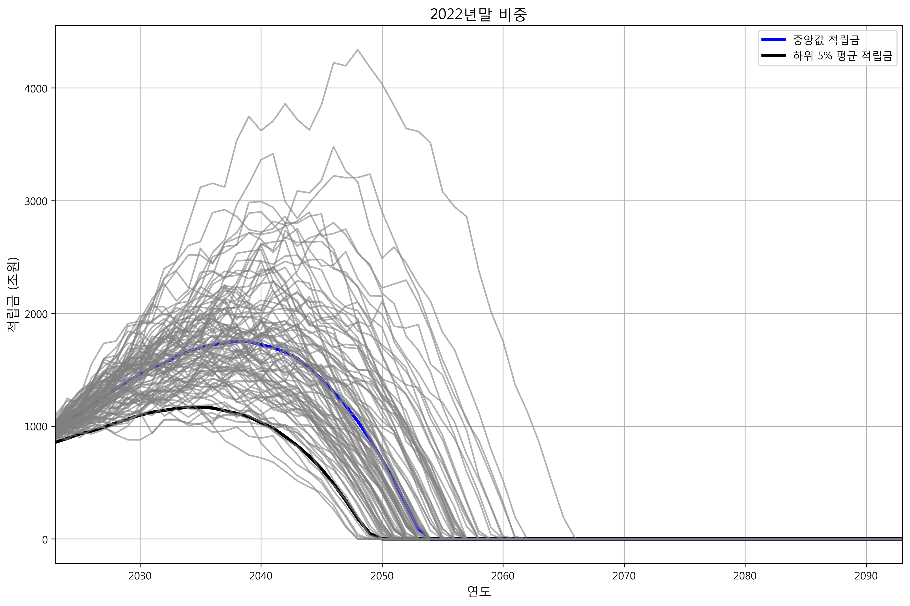
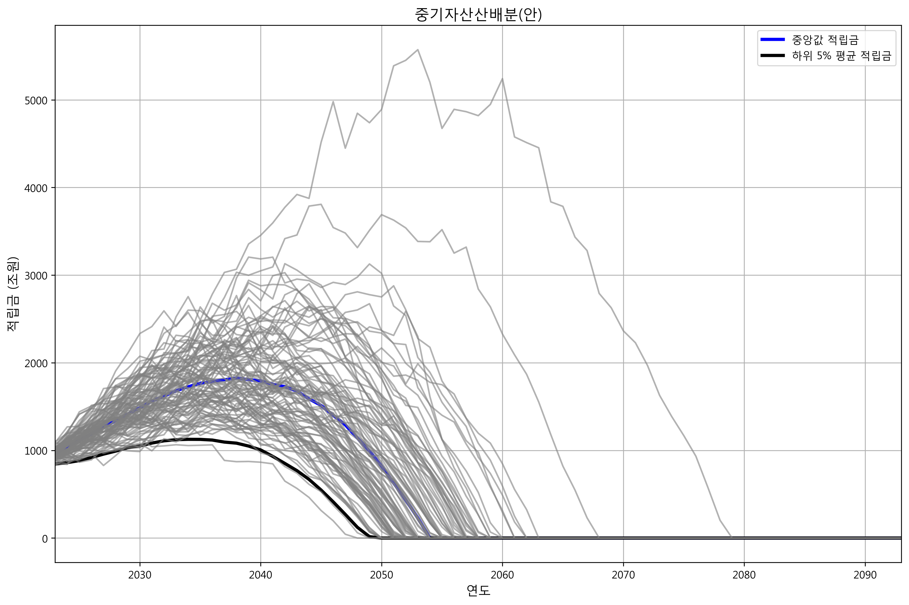
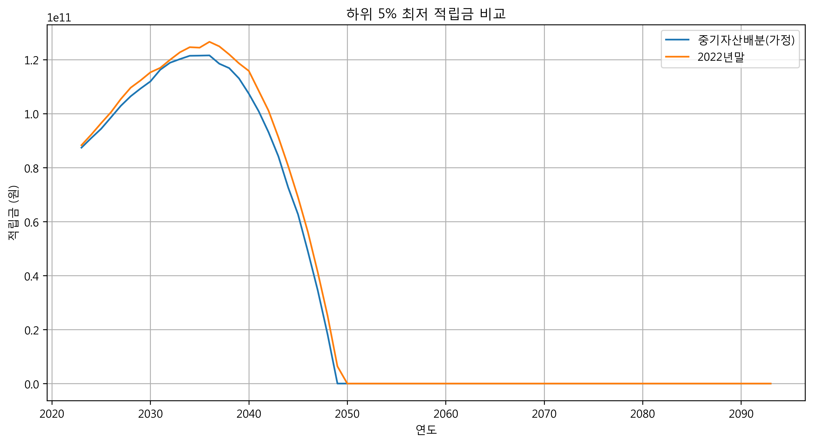
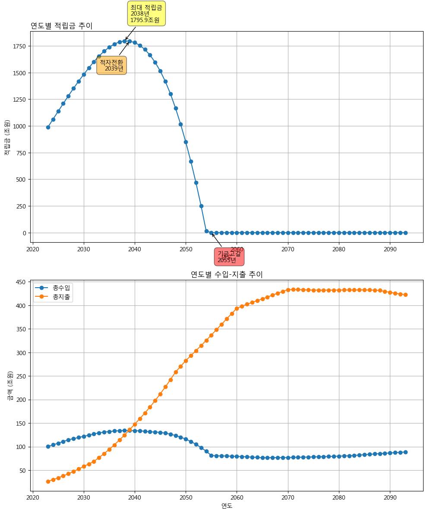
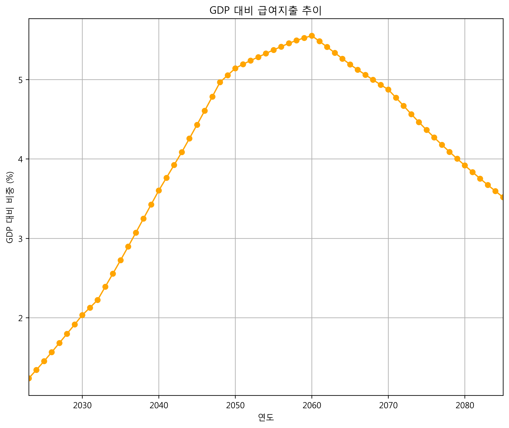
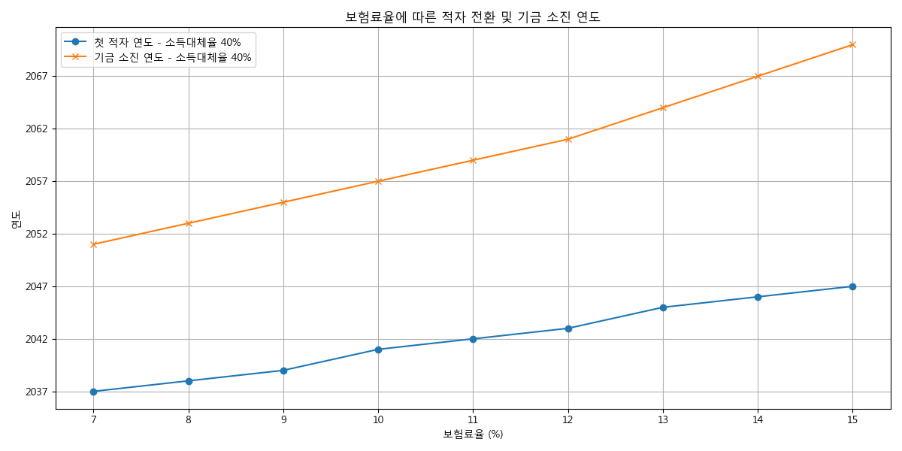
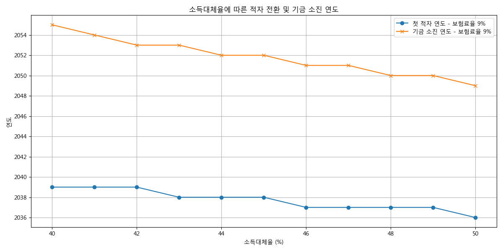

# 국민연금 ALM 초 간소화 모델 


<div style="float: right; font-size: 0.8em; text-align: right;">
박정현<br>
jh70035@gmail.com<br>

</div>


## 프로젝트 소개 
이 미니 프로젝트는 국민연금의 자산배분(ALM) 분석을 위한 초 간소화된 모델입니다. 국민연금 제5차 재정계산(2023)의 주요 가정을 적용하여 2023년부터 2093년까지의 인구구조 변화, 경제 변수, 연금 가입 및 수급 상황을 예측하고 특히 기금운용전략에 따른 기금의 장기 흐름을 분석합니다.

[국민연금 연구원 연차보고서2023-02](https://raw.githubusercontent.com/jeonghnpark/nps_mini/main/docs/(%EC%97%B0%EC%B0%A8%EB%B3%B4%EA%B3%A0%EC%84%9C%202023-02)%202024%EB%85%84%20%EA%B5%AD%EB%AF%BC%EC%97%B0%EA%B8%88%EA%B8%B0%EA%B8%88%EC%9D%98%20%EC%9E%90%EC%82%B0%EB%B0%B0%EB%B6%84%20-%20ALM%EB%B6%84%EC%84%9D%EC%9D%84%20%EC%A4%91%EC%8B%AC%EC%9C%BC%EB%A1%9C%20-%20(2).pdf)의 결과를 재현합니다. 


## 주요 기능
- 인구모듈(DemographicModule)
- 거시경제변수 모듈 (EconomicModule)
- 가입자 모듈 (SubscriberModule)
- 급여지출 모듈 (BenefitModule)
- 재정수지 모듈 (FinanceModule)
- 투자모듈(InvestmentModule)
- 확률적 시뮬레이션 

## 참고문헌
- [연차보고서 2023-02 - 2024년 국민연금기금의 자산배분 -ALM분석을 중심으로](https://raw.githubusercontent.com/jeonghnpark/nps_mini/main/docs/(%EC%97%B0%EC%B0%A8%EB%B3%B4%EA%B3%A0%EC%84%9C%202023-02)%202024%EB%85%84%20%EA%B5%AD%EB%AF%BC%EC%97%B0%EA%B8%88%EA%B8%B0%EA%B8%88%EC%9D%98%20%EC%9E%90%EC%82%B0%EB%B0%B0%EB%B6%84%20-%20ALM%EB%B6%84%EC%84%9D%EC%9D%84%20%EC%A4%91%EC%8B%AC%EC%9C%BC%EB%A1%9C%20-%20(2).pdf)

- [국민연금 제5차 재정계산 결과 (2023)](https://raw.githubusercontent.com/jeonghnpark/nps_mini/blob/main/docs/%5B%EC%84%A4%EB%AA%85%EC%9E%90%EB%A3%8C%5D_%EC%9E%AC%EC%A0%95%EC%B6%94%EA%B3%84_%EA%B2%B0%EA%B3%BC.pdf)

- 통계청 2023년 사망원인통계 (2023)
- 고용노동부 근로자의 평균임금(성/사업체규모/연령별) 통계 (2024)
- 통계청 총조사인구 성/연령별 통계 (2024)

### 주요 결과 그래프

#### 1. 자산배분 전략에에 따른 적자 전환 및 기금 소진 연도 
([연차보고서](https://raw.githubusercontent.com/jeonghnpark/nps_mini/main/docs/(%EC%97%B0%EC%B0%A8%EB%B3%B4%EA%B3%A0%EC%84%9C%202023-02)%202024%EB%85%84%20%EA%B5%AD%EB%AF%BC%EC%97%B0%EA%B8%88%EA%B8%B0%EA%B8%88%EC%9D%98%20%EC%9E%90%EC%82%B0%EB%B0%B0%EB%B6%84%20-%20ALM%EB%B6%84%EC%84%9D%EC%9D%84%20%EC%A4%91%EC%8B%AC%EC%9C%BC%EB%A1%9C%20-%20(2).pdf) 98 페이지 재현)
##### 1-1. 2022년말 포트폴리오를 유지하는 경우

- 기금은 2038년에 최대 적립금 1788조 도달후 지속 감소 추세
- 2039년 최초로 기금 적자 전환
- 2054년 기금 소진
 ##### 1-2. 중기 자산배분안(가정)

- 기금은 2039년에 최대 적립금 1851조 도달후 지속 감소 추세
- 2040년 최초로 기금 적자 전환
- 2055년 기금 소진
 ##### 1-3. 하위 5%비교

- 중기자산배분의 경우보다 2022년말 기준의 적립금이 높은 이유는 중기자산배분안의 
위험자산의 비중(변동성)이 크기 때문

#### 1-4. 포트폴리오별 기금적립금 추이
| 연도 | 구분 | 2022년 말 비중유지 | 중기자산배분(안) |
|------|------|-------------------|-----------------|
| 2030 | 중위 | 1,460.9 | 1,488.5 |
|      | 하위 5% | 1,153.2 | 1,119.5 |
| 2040 | 중위 | 1,715.7 | 1,789.7 |
|      | 하위 5% | 1,158.5 | 1,074.1 |
| 2050 | 중위 | 677.1 | 788.6 |
|      | 하위 5% | 기금소진 | 기금소진 |


#### 2. 연도별 적립금 추이(기본가정)

- 기금은 2038년에 최대 적립금 도달후 지속 감소 추세
- 2039년 최초로 기금 적자 전환
- 2055년 기금 소진


#### 3. GDP대비 급여지출



#### 4. 민감도 분석
기본가정(소득대체율 40%, 보험료율 9%)에서 주요 변수들의 민감도는 다음과 같습니다:
- 보험료율 1% 증가시 최대적립금 258.5조원 증가
- 보험료율 1% 증가시 기금소진연도 2.5년 연장
- 소득대체율 1% 증가시 기금소진연도 0.5년 단축


##### 4.1 보험료율에 따른 적자 전환 및 기금 소진 연도

- 보험료율이 증가함에 따라 적자 전환 연도와 기금 소진 연도가 늦춰지는 경향을 보임
- 보험료율이 높을수록 기금 소진이 지연됨

##### 4.2 소득대체율에 따른 적자 전환 및 기금 소진 연도  

- 소득대체율이 증가할수록 적자 전환 연도와 기금 소진 연도가 앞당겨지는 경향을 보임
- 소득대체율이 높을수록 급여지출이 증가하여 기금 소진이 가속화됨


## 주요 매개변수(기본가정)
### 인구 변수
- 합계출산율: 2023년 0.73명 → 2050년 1.21명
- 기대수명: 2023년 84.3세 → 2070년 91.2세
- 국제순이동: 연간 4-5만명 수준

### 경제 변수
- GDP 성장률: 2023년 2.2% → 2060년 0.7%
- 임금상승률: 2023년 2.3% → 2060년 1.5%
- 물가상승률: 2023년 3.3% → 2027년 이후 2.0%

### 연금 변수
- 보험료율: 9%
- 소득대체율: 40%
- 수급개시연령: 65세


## 개선 계획 


## 설치 방법
*   **Windows:**
    ```bash
    python -m venv venv
    .\venv\Scripts\activate
    ```
*   **macOS/Linux:**
    ```bash
    python3 -m venv venv
    source venv/bin/activate
    ```
```bash
pip install -r requirements.txt
```


## 실행 방법
### 1. 단일 모델 실행(기본가정)
```python
nps = NationalPensionModel()
rs = nps.run_projection()
save_results_to_csv(rs)
create_financial_plots(rs)
create_demographic_plots(rs)
```
### 3. 기금운용정책별 시나리오 분석(ALM)과 시각화
자산배분 비율 편집
```
자산배분 비율 :  InvestmentModule:: _get_default_asset_allocation
기대 수익률: InvestmentModule:: _get_default_expected_returns
변동성 : InvestmentModule:: _get_default_volatilities 
```

```python
nps_stochastic = NationalPensionModel(stochastic=True, simulation_number=1000)
rs_stochastic = nps_stochastic.run_projection()
save_stochastic_result_to_csv(rs_stochastic)
create_stochastic_financial_plots(
    rs_stochastic, timestamp=None, title="중기자산산배분(안)"
)
create_stochastic_demographic_plots(rs_stochastic)
```


## 출력 결과
모델은 다음 CSV 파일과 이미지 파일을 생성합니다:
- `csv/financial_results_실질_[timestamp].csv`: 재정수지 결과
- `csv/demographic_results_실질_[timestamp].csv`: 인구예측 결과
- `csv/simulation_results_[timestamp].csv` : 시뮬레이션 결과 
- `images/data/nps_reserve_fund_[timestamp].png`: 연도별 누적 적립 기금
- `images/lineplot_xxxx.png`: 각종 시뮬레이션 결과 시각화
- `images/stochastic_simulation_paths_[timestamp]`: stochastic simulation

